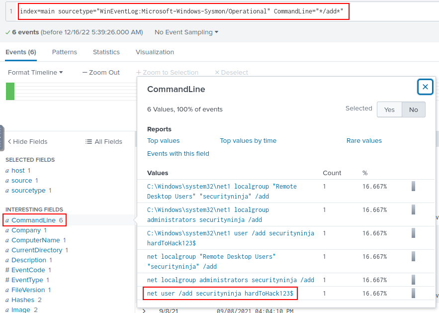

# Conti Ramsomeware - Splunk 

### Challenge Scenario
> Some employees from your company reported that they can’t log into Outlook. The Exchange system admin also reported that he can’t log in to the Exchange Admin Center. After initial triage, they discovered some weird readme files settled on the Exchange server. Below is a copy of the ransomware note.


> You have been assigned to investigate this situation, using Splunk to answer the Questions regarding the Conti ramsomware.

```
At this point I'd like to say I don't have much experience with Splunk and in the past I've only used SIEM tools such as Solarwinds SEM, Rapid7,  and ELK. So I had to do some reading, I found these books useful!
```
  

```
I also found alot of useful resources online, which i'll mention as I used them throughout this scenario.
```
```
First useful online resource 

https://github.com/vaquarkhan/splunk-cheat-sheet

```
> So first lets take a look at the Splunk GUI


> Firstly lets look into how Splunk works, 
> 
> Splunk has three main components, namely Forwarder, Indexer, and Search Head. These components are explained below:


### Splunk Forwarder

> Splunk Forwarder is a lightweight agent installed on the endpoint intended to be monitored, and its main task is to collect the data and send it to the Splunk instance. It does not affect the endpoint's performance as it takes very few resources to process. Some of the key data sources are:

* Web server generating web traffic.
* Windows machine generating Windows Event Logs, PowerShell, and Sysmon data.
* Linux host generating host-centric logs.
* Database generating DB connection requests, responses, and errors.


### Splunk Indexer

> Splunk Indexer plays the main role in processing the data it receives from forwarders. It takes the data, normalizes it into field-value pairs, determines the datatype of the data, and stores them as events. Processed data is easy to search and analyze.


### Search Head

> Splunk Search Head is the place within the Search & Reporting App where users can search the indexed logs as shown below. When the user searches for a term or uses a Search language known as Splunk Search Processing Language, the request is sent to the indexer and the relevant events are returned in the form of field-value pairs.


> Now we have this out the way lets get investigting.

### Initial Setup
> So looking into the information I we have picked up so far, I decided to start by going to “Settings → Indexes” after logging in to Splunk. Here, I can see the index being used is “main”, Splunk’s default index where all the processed data is stored.


> So now I wanted to check if the data pipelines have ingested and can be loaded successfully

~~~~
index="main" earliest=0
~~~~

> Just like that we can see we have 28,145 events


> So now we have the data loaded we need to find what sources we have 

~~~~
index="main" earliest=0 | stats count by sourcetype | sort -count
~~~~


> We will be leveraging 
>
>“WinEventLog:Mircrosoft-Windows-Sysmon/Operational”: commonly used add-on for Windows logging. With Sysmon logs, you can detect malicious activity by tracking code behavior and network traffic, as well as create detections based on the malicious activity.

> Now to the Challenge questions

### 1. Can you identify the location of the ransomware?

> So based on what we have learnt so far we know we have the main index and the WinEventLog:Mircrosoft-Windows-Sysmon/Operational source type

~~~~
index=main sourcetype="WinEventLog:Microsoft-Windows-Sysmon/Operational"
~~~~


> we also find here the answer to Q2 the EventID

> I can see Event ID 11 FileCreate, which is logged when a file is created or overwritten and can be useful to identify if any suspicious files were created. I used the search below to filter for this type of event:
>
~~~~
index=main sourcetype="WinEventLog:Microsoft-Windows-Sysmon/Operational" EventCode=11
~~~~


### 2. What is the Sysmon event ID for the related file creation event?

> Refer to solution for question 1 above.

### 3. Can you find the MD5 hash of the ransomware?

> To find the MD5 hash of the ransomware, I included the “Image” value seen in question 1 earlier and typed “md5” to identify any fields that have an MD5 hash value:
>
~~~~
index=main sourcetype="WinEventLog:Microsoft-Windows-Sysmon/Operational" Image="c:\\Users\\Administrator\\Documents\\cmd.exe" md5
~~~~

> A single event is returned which contains the MD5 hash for the ransomware:


### 4. What file was saved to multiple folder locations?

> Still working with Sysmon EventID 11, I found an interesting site 

```
https://lantern.splunk.com/Security/Use_Cases/Forensics/Investigating_a_ransomware_attack/Files_that_belong_to_a_network_user
```
which used a field called “TargetFilename”. Using the search below, I was able to identify the same filename being stored in multiple locations:
~~~~
index=main sourcetype="WinEventLog:Microsoft-Windows-Sysmon/Operational" EventCode=11 
| stats count by TargetFilename
~~~~


> and we find that readme.txt file was saved to multiple locations.

### 5. What was the command the attacker used to add a new user to the compromised system?

> From experience we know that the windows net command is used to add users to a system:
~~~~
net user username password /add
~~~~

> Using Sysmon, the field commandline could be used to filter for commands. I used a wildcard for the commandline field value in the search query to find any commands that contained “/add”:

~~~~
index=main sourcetype="WinEventLog:Microsoft-Windows-Sysmon/Operational" CommandLine="*/add*"
~~~~

> Looking at the interesting fields, I could see under the “CommandLine” field the command used to add a new user to the compromised system:


