# Vulnerable API - THM BookStore 

### https://tryhackme.com/room/bookstoreoc#

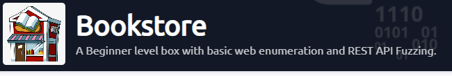
> Starting off the usual way, simlple nmap scan. here we find 3 ports open 
```
port 22 - ssh 
port 80 - http 
port 5000 - api 
```

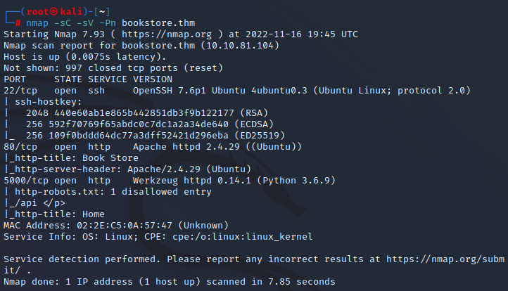

> We immediately jump over to the http page where we see the beginnings of a book store coming together 


> We find a login page but nothing really of note, we could try a brute force later one. I just wanted to check on the source code to make sure nothing was left in there by lazy developers.
>
> and bingo we find our first bit of interesting information 

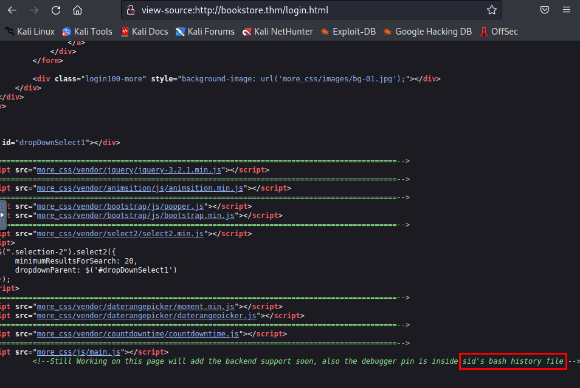
```
sid's bash history file 

```
> So we now know we are looking at a user called Sid 


> After looking around more I couldn't help but think of the api on port 5000, so over to that, the nmap scan did give us a /api folder but what else was on port 5000 over to gobuster to see what we can find.

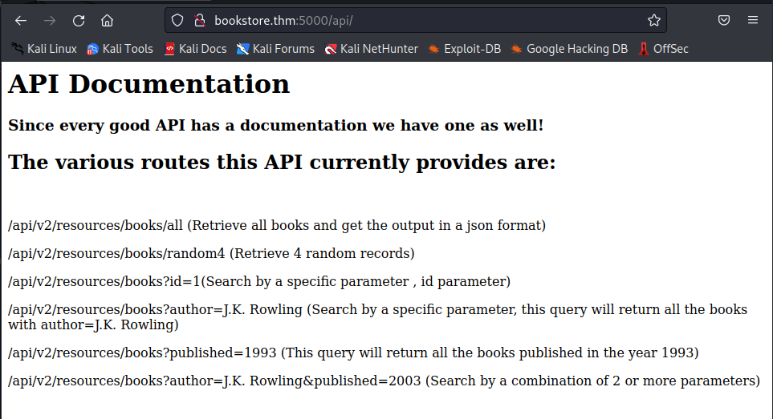
> a straight forward gobuster scan found /console directory  

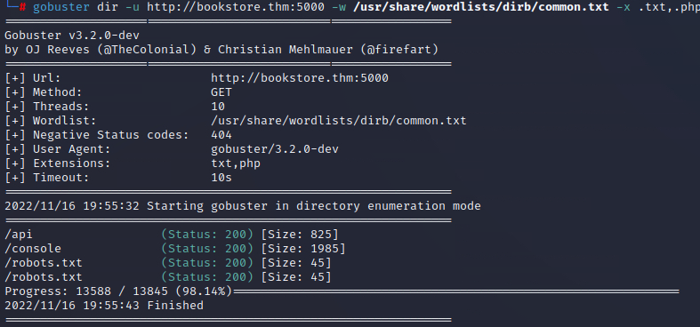

>Looks like a pin code is needed, after trying a few things I decided to come back to this later  

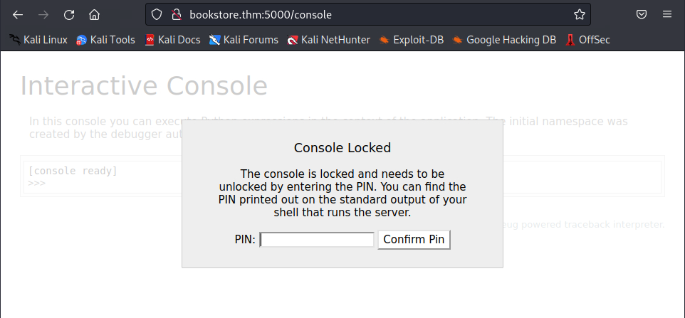

> So I wanted to look at the apis and I admit api and fuzzing are not my strong point but I've recently been reading alot on the topic, so I started with /api/vs/resources/books?id= which got me know where  

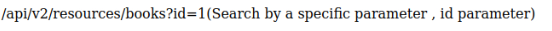

> then something dawned on me that i read earlier when looking through some source code in the site. 
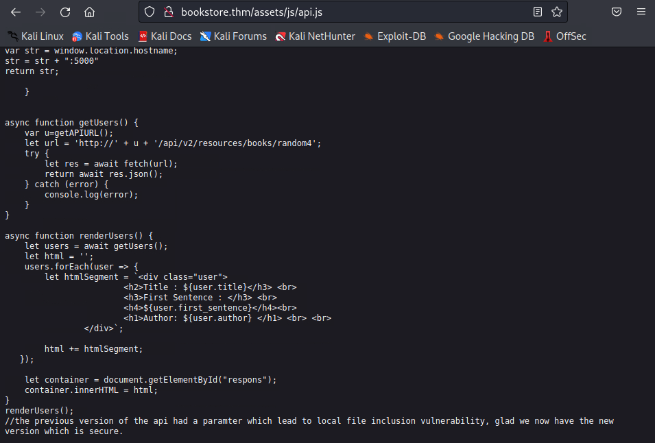

```
the previous version of the api...
```
> Was there a v1 

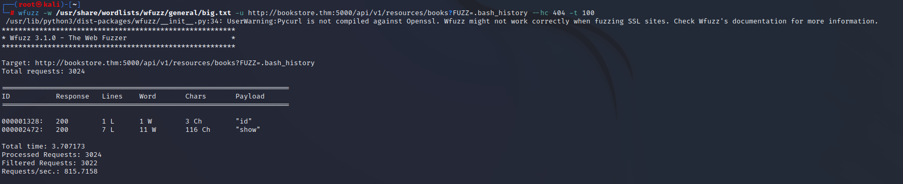

> There was and it was vulnerable, using the file we found earlier from user sid - .bash_history we where able to find the pin for the /console directory

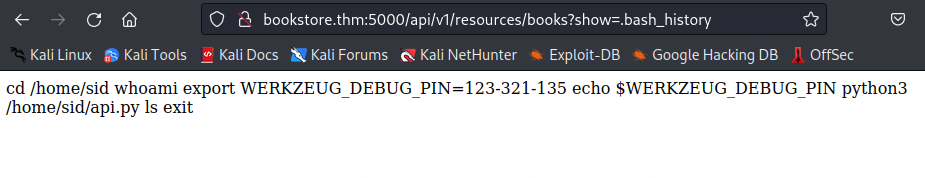

> And just like that a interactive python console, time for a python reverse shell 

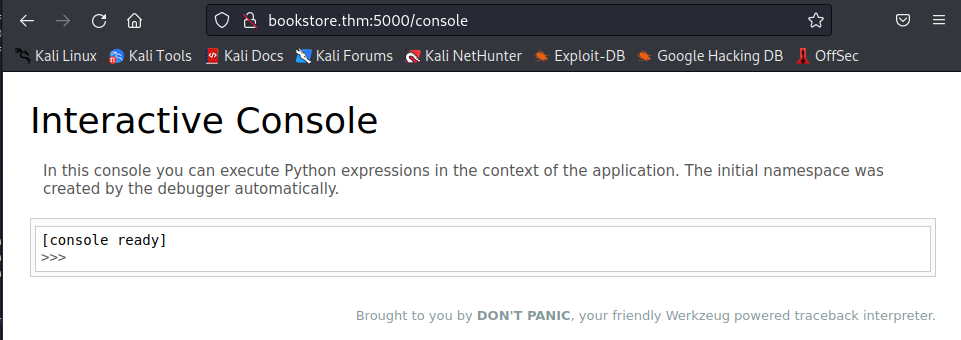

> Over to online reverse dhell generator 

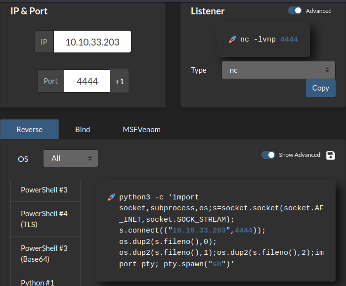

> Made sure the reverse shell was listening & success! We have popped the box 

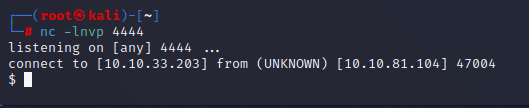

> I stablished the shell and off we go to try to get the root flag

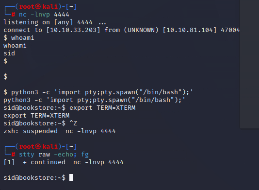

> User.txt is in the directory 

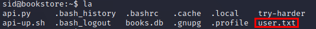
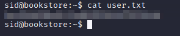

> We also see a file called try-harder at first I didn't think much of it until linpeas also highlighted it, cat'ing the file show some weird output so I knew I needed to analzye this somehow.

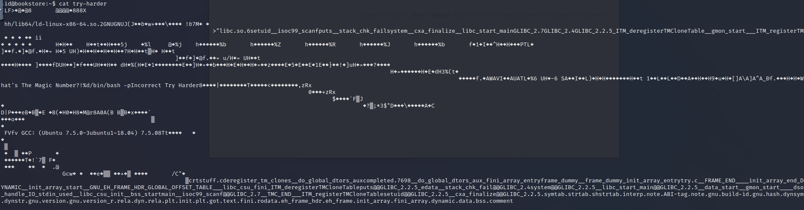

> trying to run the app we get a prompt for the magic number 

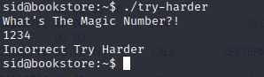

> After trying some stupid things (not that i'm happy to admit it took me more time than i like to admit) i decided to get the try-harder file on the attack box with a simple python http server.

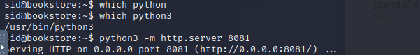


> After some more googling i came across a program called Ghidra an reverse engineering framework 


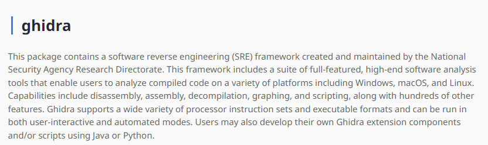

> While analysing the code we come across a line s_/bin/bash_-p_ this had to be something interesting 
>
>clicking on the code we get more info on the right, by the looks of things the Magic number is some sort of equation! 
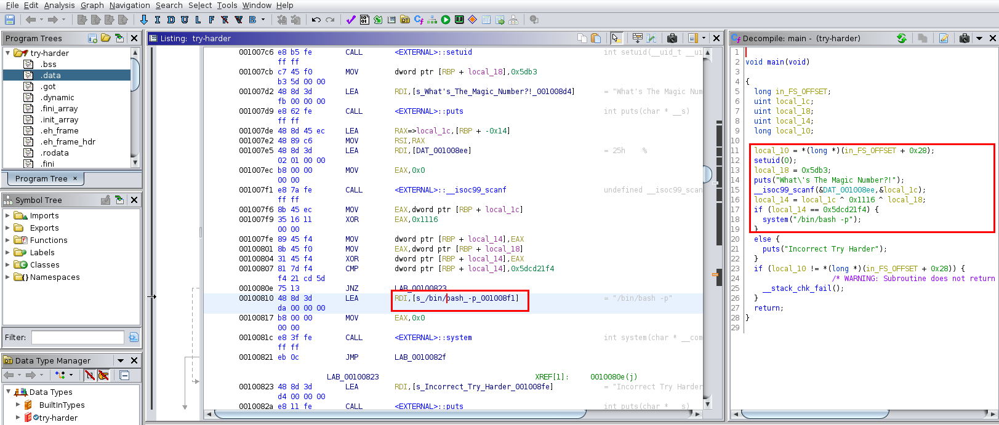

> hoverign over the Hexidedcimal numbers it auto converts to Decimal which i would assume i need for the Magic number to work!

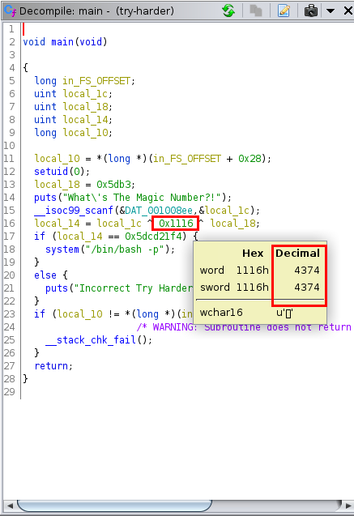

> googling around i found that the ^ ^ around the Hex numbers mean c formatter XOR property which would make sense as above equation needed.

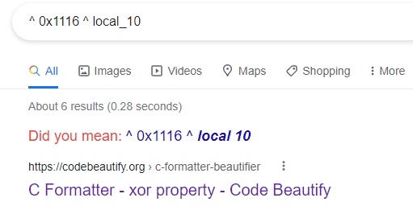

> I need to make sure its correct so i went over to a online Hexidecimal to Decimal converter by the looks of things i have 3 values 

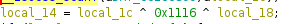


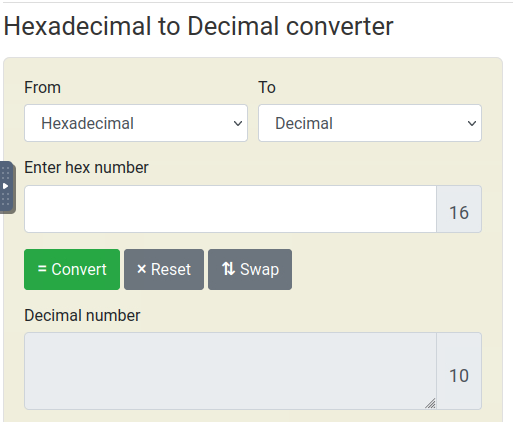
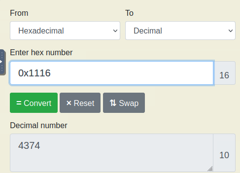
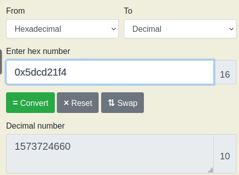
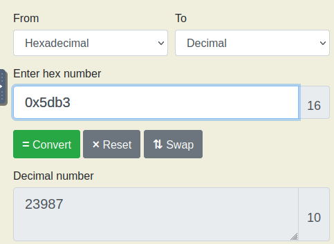

> Then over to an online XOR Calcualtor and we have a number to test 

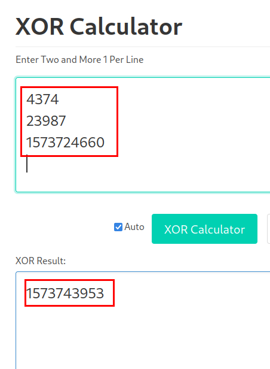

> we run the app again and this time use our magic number!

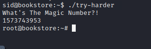

> and we are Root!

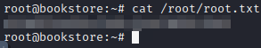


L33gat5KtTN77kb19aY6%6tj1